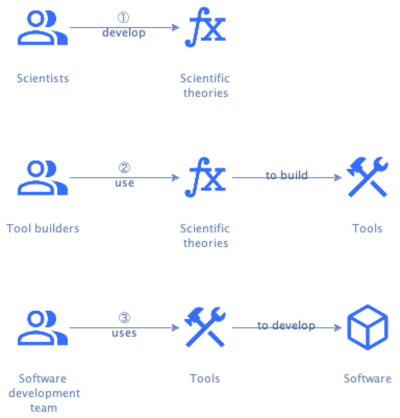

# Software Engineering Workbench (SEW) 

Since engineering is the application of scientific principles to solve practical problems, we'd need a science of
software development to create software engineering.
This science formalizes technology-specific knowledge about how best to develop software and organizes it in a coherent
scientific theory.
And then we need to build tools based on that scientific theory:

A set of such tools supporting the full software development lifecycle is a **Software Engineering Workbench** (SEW).
