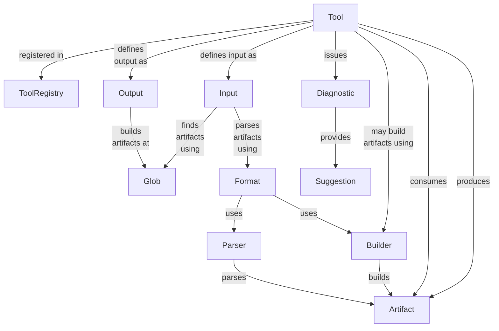

# Tool infrastructure

If we maintain a registry of tools, we can reason about them in the abstract.
For instance, a Gradle plugin could read all tools from the registry and generate task definitions, without
understanding any specifics about any particular tool.
Or an IntelliJ plugin could read all artifact types and register syntax highlighters/parsers for them, without
understanding any specifics about any particular artifact type or file format.

Every tool would live in its own jar and depend on a shared jar that implements the above model and on jars that
implement parsers/builders for the artifact type that it uses/produces.

## Gradle

- `assemble` task depends on each tool's "build" functionality
- `check` task depends on each tool's "validation" functionality
- `help` task depends on each tool's "suggestions" functionality
