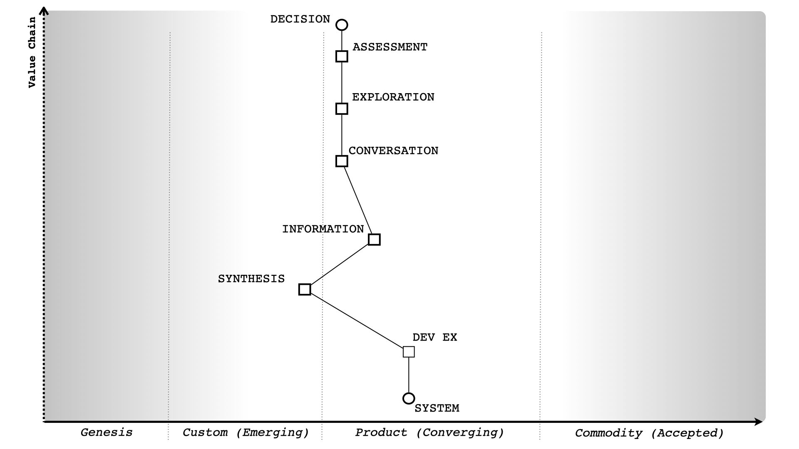
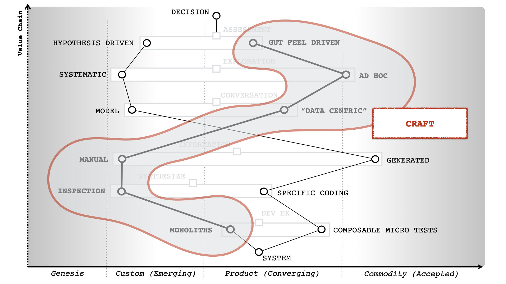
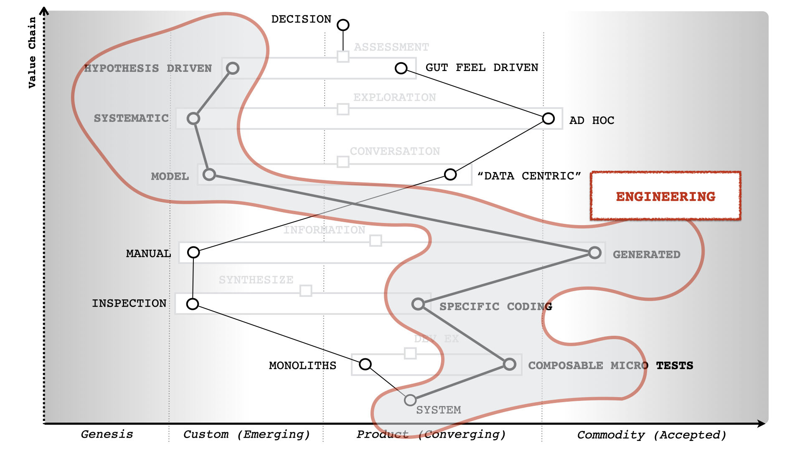

# Methodology

The basic idea behind the methodology is that a software development project starts with basic artifacts that
capture the requirements, and then the tooling generates further artifacts and suggests next steps.
At various points in the development lifecycle, there will be more than one possible next step.
Also, multiple iterations through the lifecycle may happen concurrently.

The motivation behind this idea is that we want to enhance and speed up decision-making, which is the essence of
software development.
We also want to move decision-making from a craft to engineering.

