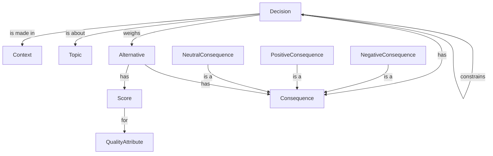

# Architectural decisions

## Analysis

In software development, as soon as we move from the problem space to the solution space, we start using technology.
We need to decide what technology to use, since there are many valid choices, and the right one depends heavily on the
context in which the decision is made.

We should document those decisions, with rationale, in _Architecture Decision Records_ (ADRs).
As always, we use a structured format to capture a decision and render it in ADR format.

Some decisions require more thorough evaluation than others.
There is a spectrum from no rationale at all (obvious decision for the given context), via some rationale with simple
pros and cons (most cases), to a full-blown decision matrix showing decision drivers and scores for each of the
alternatives (high-stake decisions that are costly to get wrong).

Architectural decisions are interrelated.
If we choose Java as programming language, then the options for testing framework are JUnit, TestNG, and potentially
others.
If, however, we pick C# as programming language, those options are no longer valid, and we must select from a different
set.

A further complication is that some choices are multi-select.
For instance, we can pick Go as backend programming language, and TypeScript for the frontend.
Or maybe we have a microservices architecture, and some backend services are implemented in Python and others in Rust.

From an architecture perspective, any decision is just that: a decision.
From the perspective of supportive tooling, however, we need to understand what a given decision is about: its topic.
For instance, a decision about a programming language impacts how a tool generates unit tests from acceptance tests.



## Format

Obvious decision:

```
decision Api {
    context = "We want to expose a backend API to our frontends."
    topic   = api
    choices = [ "JsonOverHttp" ]
}
```

For multiple choices, a rationale is required:

```
decision BackendLanguage {
    topic     = programmingLanguage
    choices   = [ "Java", "Kotlin" ]
    rationale = "Java for legacy, Kotlin for new services"
}
```

**TODO: Since most decisions pick a single choice, can we support both single values and lists?**

More deliberate weighing of alternatives:

```
decision Rendering {
    topic   = webUiRendering
    choices = [ "ServerSide" ]
}

alternative ServerSide {
    description = "Render HTML on the server and send it to the client."
    pros        = [ "Fast initial time to market" ]
    cons        = [ "May lead to sub-optimal user experience in certain areas" ]
}

alternative ClientSide {
    description = "Render HTML on the client."
    pros        = [ "Optimal user experience" ]
    cons        = [ "Longer initial time to market", "Additional technology to learn" ]
}

alternative Hybrid {
    description = "Render HTML on the server and send it to the client. The HTML includes client-side technologies."
    pros        = [ "Fast initial time to market", "Optional user experience" ]
    cons        = [ "Additional technology to learn" ]
}
```

High-stake decision:

```
decision Rendering {
    topic   = webUiRendering
    choices = [ "ServerSide" ]
}

driver TimeToMarket {
    weight = 50
}

driver UserExperience {
    weight = 30
}

driver LearnAdditionalTechnology {
    weight = 20
}

alternative ServerSide {
    description = "Render HTML on the server and send it to the client."
    scores      = [
      "TimeToMarket:5",
      "UserExperience:3",
      "LearnAdditionalTechnology:5"
    ]
}

alternative ClientSide {
    description = "Render HTML on the client."
    scores      = [
      "TimeToMarket:2",
      "UserExperience:5",
      "LearnAdditionalTechnology:1"
    ]
}

alternative Hybrid {
    description = "Render HTML on the server and send it to the client. The HTML includes client-side technologies."
    scores      = [
      "TimeToMarket:5",
      "UserExperience:5",
      "LearnAdditionalTechnology:1"
    ]
}
```

The mapping of scores to drivers is not great, but since this level of decision record is presumably rare, it beats
making changes to the language definition / parser.
We can always introduce a dedicated editor to hide the ugly syntax.


## Implementation

`ArchitectureTool` is the main processor of decisions, but other tools need them too.
It therefore makes sense to capture the logic about topics and their interrelations in a domain service.

The programming language topic impacts most other decisions.
It therefore makes sense to make that a first-class citizen that drives options for other topics.
A plug-in architecture would make it easier to add languages.
