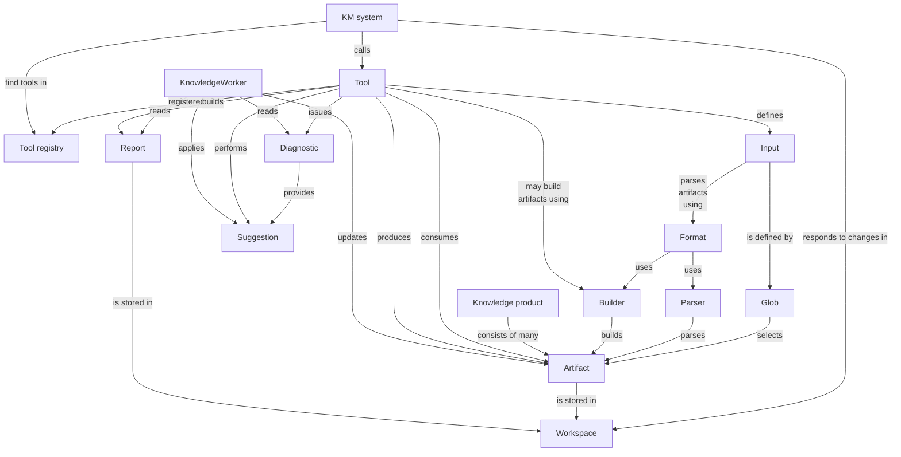
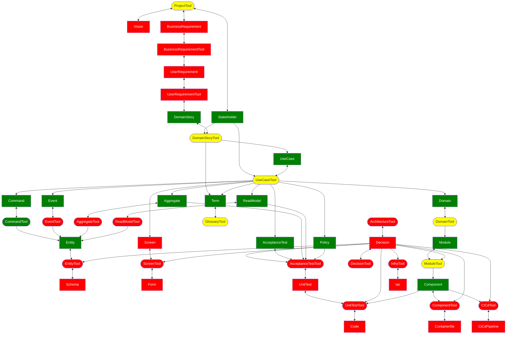

# Tools and artifacts

The architecture of a knowledge management (KM) system is mainly
[pipes and filters](https://www.enterpriseintegrationpatterns.com/patterns/messaging/PipesAndFilters.html):

- The filters are **tools** that consume inputs and produce outputs.
- The inputs are **artifacts** that capture knowledge about the problem to solve.
- The outputs are either new or updated artifacts that knowledge workers enhance, or **reports** that help knowledge
  workers enhance artifacts.
- The **KM system** implements the pipes that connect the output artifacts of one tool to the input artifacts of others.
- The **knowledge product** is the sum of all artifacts.

The KM process kicks off with one or more tools that issue diagnostics with suggestions to get the
endeavor started.
Applying those suggestions creates skeletons of artifacts, which knowledge workers then add knowledge to.
Some of those additions trigger a tool to create more artifacts, etc.
The process ends when all artifacts that make up the knowledge product are complete.

For instance, in a case management system for social workers, the system may start with the suggestion to add details
about a client.
The social worker adds those details, which prompts the system to suggest adding information about the client's problem, 
etc, etc.

## Software development tools and artifacts

At a high level, the same happens in software development.
The Software Engineering Workbench (SEW) kicks off a project by asking for a vision.
Once the business sponsor adds that, the SEW asks for business requirements, etc, etc.
The software development process ends when code running in production is contributing positively to the business goals,
as outlined in the vision.

Note that there are two starting points: `ProjectTool` kicks off exploration of the problem space, while
`ArchitectureTool` starts off navigation of the solution space.
Developing software requires tackling both essential and accidental complexity.

## Performance considerations

Speaking of complexity, a big difference between a social worker's case and a software system is their complexity, as
measured by the number of artifacts required to describe the knowledge product.
It's therefore important that a SEW handles large numbers of artifacts efficiently:

- It should cache the results of finding artifacts in the workspace that match globs for a tool, since different tools
  use the same inputs and tools run frequently.
- It should keep track of changes to artifacts and automatically run the appropriate tools to validate them.
  It should also cache suggestions associated with those validations, so that it can present them to knowledge workers
  when they're ready to act on them.
- It should only build reports when necessary, i.e. when the inputs on which they depend change.
- Caches should persist between sessions.

A SEW that stores artifacts in a file system should maintain a `.sew` directory containing:

- `globs/<glob>` contains a list of artifacts matching the glob
  - updated when artifacts matching the glob are added or deleted
- `suggestions/<tool>/<location>/<suggestion>` contains a suggestion for artifacts at a given location
  - deleted before a tool validates an artifact at the location
  - created based on the validation results
- `reports/<tool>/<location>/<report>` contains the report created by the given tool for the artifact at the given
  location
  - this is a directory containing one or more files
  - deleted before a tool build reports
  - created based on the reports created by the tool
