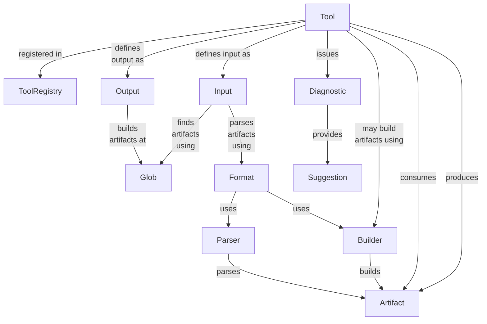

# Architecture

The architecture is mainly
[pipes and filters](https://www.enterpriseintegrationpatterns.com/patterns/messaging/PipesAndFilters.html):

- The filters are tools that consume inputs and produce outputs.
- The overall system implements the pipes that connect the outputs of one tool to the inputs of another.

## Tools infrastructure

If we maintain a registry of tools, we can reason about them in the abstract.
For instance, a Gradle plugin could read all tools from the registry and generate task definitions, without
understanding the specifics of any particular tool.
Or an IntelliJ plugin could read all input formats and register file extensions and syntax highlighters for them,
without understanding the specifics of particular file format.

Every tool would live in its own jar and depend on a shared jar that implements the above model and on jars that
implement parsers/builders for the artifact type that it uses/produces.

## Gradle

- `assemble` task depends on each tool's "build" functionality
- `check` task depends on each tool's "validation" functionality
- `help` task depends on each tool's "suggestions" functionality

## Tools & artifacts

